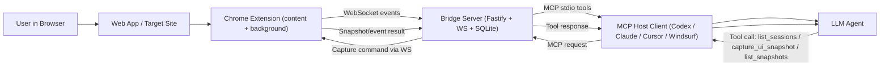

# HOW TO USE BROWSER DEBUG MCP BRIDGE

This guide explains how to use Browser Debug MCP Bridge from any project through MCP.
You can run it from npm (recommended) or from a local Git clone.

## What this project is

This repo gives you two things:
1. A Chrome extension that records browser debugging context (events, network, snapshots).
2. A local MCP server that lets LLM clients query that context with tools.

## Architecture diagram



If Mermaid is not rendered in your viewer, use this fallback:

```text
User -> Web App -> Chrome Extension -> Bridge Server (WS + DB)
LLM <-> MCP Host Client <-> Bridge Server (MCP stdio)
When LLM asks snapshot: Bridge Server -> Extension -> Bridge Server -> LLM
```

What the diagram means:
1. The extension collects runtime browser data and sends it to the local bridge server.
2. The bridge server stores data in SQLite and exposes it as MCP tools.
3. Your MCP client connects the LLM to those tools.
4. When the LLM asks for a snapshot, the server sends a capture command back to the extension.

## Before you start

You need:
1. Node.js 20+
2. pnpm 9+ (only for local clone mode and extension build from source)
3. Git (only for local clone mode)
4. Google Chrome

Check versions:

```bash
node -v
pnpm -v
git --version
```

## Step 1: Choose installation mode

MCP runtime modes:
1. npm package mode (recommended for most users)
2. local Git clone mode (best for contributors/customization)

### 1A) npm package mode (recommended)

In MCP client config use:
1. command: `npx`
2. args: `["-y", "browser-debug-mcp-bridge"]`

### 1B) Local clone mode

```bash
git clone https://github.com/<ORG_OR_USER>/browser-debug-mcp-bridge.git
cd browser-debug-mcp-bridge
pnpm install
```

Important:
1. Keep this folder on disk.
2. MCP clients will run this repo directly from its local path.
3. This mode is optional if you use npm package mode.

Alternative one-step setup:

1. Windows PowerShell:
   - `.\install.ps1`
2. macOS/Linux:
   - `bash ./install.sh`

## Step 2: Build and load the extension (required)

Note:
1. npm package mode covers MCP server startup only.
2. You still need the extension loaded in Chrome.

Build:

```bash
pnpm nx build chrome-extension
```

Load into Chrome:
1. Open `chrome://extensions`
2. Enable **Developer mode**
3. Click **Load unpacked**
4. Select `dist/apps/chrome-extension`

Expected result:
1. The extension appears in the extension list.
2. You can open its popup.

## Step 3: Start the universal MCP runtime

Run:

```bash
pnpm install
node scripts/mcp-start.cjs
```

Or (npm mode):

```bash
npx -y browser-debug-mcp-bridge
```

What this starts:
1. HTTP/WebSocket ingest server at `http://127.0.0.1:8065`
2. MCP stdio server for MCP clients (Codex, Claude, Cursor, Windsurf, etc.)

Expected result:
1. Terminal stays running.
2. No immediate startup error.

## Step 4: Generate ready-to-paste MCP config

For local clone mode, from repo root:

```bash
pnpm mcp:print-config
```

This prints:
1. TOML snippet for Codex
2. JSON snippet for Claude/Cursor/Windsurf/other MCP JSON hosts

Optional custom path:

```bash
pnpm mcp:print-config -- --repo=<ABSOLUTE_PATH_TO_REPO>
```

## Step 5: Add MCP config in your client

Use the snippet printed in Step 4.

Common locations:
1. Codex: `C:\Users\<you>\.codex\config.toml` (or project `.codex/config.toml`)
2. Claude Desktop: `%APPDATA%\Claude\claude_desktop_config.json`
3. Cursor/Windsurf: their MCP settings page or MCP JSON config
4. OpenCode/custom clients: MCP JSON config block with same `command` + `args`

Local clone config (recommended for contributors):
1. command: `node`
2. args: `["<ABSOLUTE_PATH_TO_BROWSER_DEBUG_MCP_BRIDGE>\\scripts\\mcp-start.cjs"]`

npm config (recommended for normal users):
1. command: `npx`
2. args: `["-y", "browser-debug-mcp-bridge"]`

GitHub fallback config (if npm package is unavailable):
1. command: `npx`
2. args: `["-y", "--package=github:RobertoM80/browser-debug-mcp-bridge", "browser-debug-mcp-bridge"]`

You still need the Chrome extension loaded; these options only change MCP server startup mode.

## Step 6: Prepare a browser session

In extension popup:
1. Add your website domain to allowlist
2. Click **Start session**
3. If you want snapshots, enable snapshot settings and keep `manual` trigger enabled

Expected result:
1. Session status becomes active.
2. A session id is visible in popup.

## Step 7: Use it from any other project

Open your other project in your MCP-enabled LLM client.

Then ask the LLM to use browser-debug tools, for example:
1. `list_sessions`
2. `get_recent_events` with selected `sessionId`
3. `capture_ui_snapshot` with selected `sessionId`
4. `list_snapshots`

This works because the MCP client can call this bridge process by path, even while you work in a different repo.
It also works in npm mode because MCP client can run `npx -y browser-debug-mcp-bridge`.

## Step 8: Verify everything works

Quick checks:
1. Health endpoint responds:
   - `http://127.0.0.1:8065/health`
2. MCP client shows browser-debug tools
3. `list_sessions` returns at least one session after start
4. `capture_ui_snapshot` returns data
5. `list_snapshots` shows created snapshots

## Step 9: Update later

From this repo folder:

```bash
git pull
pnpm install
pnpm nx build chrome-extension
```

Then reload extension in `chrome://extensions`.

## Troubleshooting

If no sessions appear:
1. Session was not started in extension popup.
2. Current site is not in allowlist.

If snapshot calls fail:
1. No active session.
2. Snapshot settings disabled.
3. Extension not connected to local server.

If MCP client shows no tools:
1. Wrong repo path in MCP config.
2. Wrong MCP command/args for selected mode.
3. MCP process failed to start.
4. Another process already uses port `8065`.

## Distribution modes summary

1. npm mode:
   - `command = npx`
   - `args = ["-y", "browser-debug-mcp-bridge"]`
2. local clone mode:
   - `command = node`
   - `args` points to `<repo>/scripts/mcp-start.cjs`
3. GitHub fallback mode:
   - `command = npx`
   - `args = ["-y", "--package=github:RobertoM80/browser-debug-mcp-bridge", "browser-debug-mcp-bridge"]`
