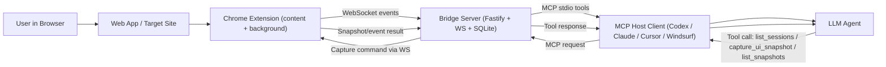

# HOW TO USE BROWSER DEBUG MCP BRIDGE

This guide explains how to use Browser Debug MCP Bridge from any project through MCP.
You can run it without cloning (recommended for normal users) or from a local Git clone.

## What this project is

This repo gives you two things:

1. A Chrome extension that records browser debugging context (events, network, snapshots).
2. A local MCP server that lets LLM clients query that context with tools.

## Architecture diagram


```mermaid
flowchart LR
  U["User in Browser"] --> B["Web App / Target Site"]
  B --> E["Chrome Extension (content + background)"]
  E -->|WebSocket events| S["Bridge Server (Fastify + WS + SQLite)"]
  S -->|MCP stdio tools| H["MCP Host Client (Codex / Claude / Cursor / Windsurf)"]
  H --> L[LLM Agent]
  L -->|Tool call: list_sessions / capture_ui_snapshot / list_snapshots| H
  H -->|MCP request| S
  S -->|Capture command via WS| E
  E -->|Snapshot/event result| S
  S -->|Tool response| H
  H --> L
```

If Mermaid is not rendered in your viewer, use this fallback:

```text
User -> Web App -> Chrome Extension -> Bridge Server (WS + DB)
LLM <-> MCP Host Client <-> Bridge Server (MCP stdio)
When LLM asks snapshot: Bridge Server -> Extension -> Bridge Server -> LLM
```

What the diagram means:

1. The extension collects runtime browser data and sends it to the local bridge server.
2. The bridge server stores data in SQLite and exposes it as MCP tools.
3. Your MCP client connects the LLM to those tools.
4. When the LLM asks for a snapshot, the server sends a capture command back to the extension.

## Before you start

You need:

1. Node.js 20+
2. npm (for quick no-repo install)
3. pnpm 9+ (only for local clone mode and extension build from source)
4. Git (only for local clone mode)
5. Google Chrome

Check versions:

```bash
node -v
npm -v
pnpm -v
git --version
```

## Step 1: Choose installation mode

MCP runtime modes:

1. no-repo mode (recommended for most users)
2. local Git clone mode (best for contributors/customization)

### 1A) No-repo mode (recommended)

Install runtime globally once:

```bash
npm i -g browser-debug-mcp-bridge
```

Then in MCP client config use direct node launch:

1. command: `node`
2. args: `["<NPM_GLOBAL_ROOT>/browser-debug-mcp-bridge/scripts/mcp-start.cjs"]`

Find `<NPM_GLOBAL_ROOT>` with:

```bash
npm root -g
```

Secondary quick option:

1. command: `npx`
2. args: `["-y", "browser-debug-mcp-bridge"]`

### 1B) Local clone mode

```bash
git clone https://github.com/<ORG_OR_USER>/browser-debug-mcp-bridge.git
cd browser-debug-mcp-bridge
pnpm install
```

Important:

1. Keep this folder on disk.
2. MCP clients will run this repo directly from its local path.
3. This mode is optional if you use no-repo mode.

Alternative one-step setup:

1. Windows PowerShell:
   - `.\install.ps1`
2. macOS/Linux:
   - `bash ./install.sh`

## Step 2: Install and load the extension (required)

Note:

1. Runtime launch mode does not include automatic extension installation.
2. You must load a compatible extension connected to `127.0.0.1:8065`.

No-repo extension option (recommended):

1. Download `chrome-extension-dist.tgz` from:
   - `https://github.com/RobertoM80/browser-debug-mcp-bridge/releases/latest`
2. Extract it locally.

Local clone extension option:

```bash
pnpm nx build chrome-extension
```

Load into Chrome:

1. Open `chrome://extensions`
2. Enable **Developer mode**
3. Click **Load unpacked**
4. Select extracted extension folder (no-repo mode) or `dist/apps/chrome-extension` (local clone mode)

Expected result:

1. The extension appears in the extension list.
2. You can open its popup.

## Step 3: Start the universal MCP runtime

No-repo mode (recommended):

```bash
npm i -g browser-debug-mcp-bridge
# then run in MCP host via:
# node <NPM_GLOBAL_ROOT>/browser-debug-mcp-bridge/scripts/mcp-start.cjs
```

No-repo secondary option:

```bash
npx -y browser-debug-mcp-bridge
```

Local clone mode:

```bash
pnpm install
node scripts/mcp-start.cjs
```

What this starts:

1. HTTP/WebSocket ingest server at `http://127.0.0.1:8065`
2. MCP stdio server for MCP clients (Codex, Claude, Cursor, Windsurf, etc.)

Expected result:

1. Terminal stays running.
2. No immediate startup error.

Runtime state location:

1. By default, local SQLite data, exports, snapshot assets, and launcher lock files are stored in a user-local app-data directory.
2. This avoids writing runtime artifacts into the repo root or into the host app working directory.
3. Set `DATA_DIR` only if you intentionally want a custom location.

Recommended persistent-host workflow:
1. Keep one long-lived bridge terminal running with:

```bash
node scripts/mcp-start.cjs --standalone
```

2. Keep your MCP client config pointing at the normal launcher:
   - `node <path-to-repo>/scripts/mcp-start.cjs`
3. New Codex/MCP sessions will attach to the existing bridge on `127.0.0.1:8065` instead of replacing it.

## Step 4: Generate ready-to-paste MCP config

For local clone mode, from repo root:

```bash
pnpm mcp:print-config
```

This prints:

1. TOML snippet for Codex
2. JSON snippet for Claude/Cursor/Windsurf/other MCP JSON hosts

Optional custom path:

```bash
pnpm mcp:print-config -- --repo=<ABSOLUTE_PATH_TO_REPO>
```

## Step 5: Add MCP config in your client

Use the snippet printed in Step 4.

Common locations:

1. Codex: `C:\Users\<you>\.codex\config.toml` (or project `.codex/config.toml`)
2. Claude Desktop: `%APPDATA%\Claude\claude_desktop_config.json`
3. Cursor/Windsurf: their MCP settings page or MCP JSON config
4. OpenCode/custom clients: MCP JSON config block with same `command` + `args`

Local clone config (recommended for contributors):

1. command: `node`
2. args: `["<ABSOLUTE_PATH_TO_BROWSER_DEBUG_MCP_BRIDGE>\\scripts\\mcp-start.cjs"]`

no-repo config (recommended for normal users):

1. command: `node`
2. args: `["<NPM_GLOBAL_ROOT>/browser-debug-mcp-bridge/scripts/mcp-start.cjs"]`

GitHub fallback config (if npm package is unavailable):

1. command: `npx`
2. args: `["-y", "--package=github:RobertoM80/browser-debug-mcp-bridge", "browser-debug-mcp-bridge"]`

You still need the Chrome extension loaded; these options only change MCP server startup mode.

## Step 6: Prepare a browser session

In extension popup:

1. Add your website domain to allowlist
2. Click **Start session**
3. If you want snapshots, enable snapshot settings and keep `manual` trigger enabled

Expected result:

1. Session status becomes active.
2. A session id is visible in popup.
3. The popup `Bridge Health` panel updates live with transport, content-script readiness, guardrails, and last-event diagnostics.
4. If the panel shows a stale/inactive state, you can use:
   - `Recover session`
   - `Retry content script`
   - `Open bound tab`

### Optional: run the experimental override POC

This is available only in local clone mode.

1. Leave the checked-in `override-poc.config.json` as the placeholder.
2. Generate or create `override-poc.local.json` in the repo root, or set `OVERRIDE_POC_CONFIG_PATH` to a custom JSON file.
3. For MCP generation, call `observe_override_assets` on the live session, then `list_observed_override_assets` to inspect persisted observations, `map_next_override_assets` for Next.js source/chunk confidence and bounded drift checks, `plan_next_source_override` for temp source-edit planning, or `create_override_profile` for direct profile generation.
4. Set `activeProfileId` and one or more exact `profiles[].rules[]` mappings from production asset URL to local built file path.
5. Rebuild:

```bash
pnpm nx build mcp-server
pnpm nx build chrome-extension
```

1. Reload the unpacked extension.
2. Start or resume the target session.
3. Open the popup `Override POC` section.
4. Choose the bound target tab.
5. Click **Enable POC**. Click **Disable** when you want to detach the debugger and stop fulfilling overrides.

The same connected session can be operated through MCP with `list_override_profiles`, `create_override_profile`, `validate_override_profile`, `observe_override_assets`, `list_observed_override_assets`, `map_next_override_assets`, `plan_next_source_override`, `enable_overrides`, `disable_overrides`, `get_override_status`, `get_override_request_log`, and `diagnose_overrides`.

Current generator adapters:

1. `nextjs` for Next.js `.next` builds
2. `static` for framework-neutral assets such as Vite, Angular, Vue, or plain `dist/assets` output

The runtime override engine stays framework-agnostic. Adapters only create exact URL/file rules for review.

What it currently proves:

1. the bridge can attach CDP to an explicitly selected bound tab
2. cache and service worker bypass can be applied before reload
3. one or more exact production assets can be replaced with local bytes from the active profile
4. override runs and matched requests are persisted under `/sessions/:sessionId/overrides/*`
5. the server can return a structured diagnosis from `/sessions/:sessionId/overrides/diagnosis`
6. active target selection is locked until the override is disabled
7. live Next.js script/style assets can be observed, persisted, and mapped to local chunks/source paths with confidence reasons
8. fetched production assets can be compared against local chunks with bounded concurrency/candidate caps to detect drift before writing rules
9. persisted observed assets feed backend diagnosis for target URL mismatches, SRI, CSP meta tags, and service-worker control
10. simple Next.js source literal edits can be planned in a temp overlay and written as exact browser override rules without mutating repo files

## Step 7: Use it from any other project

Open your other project in your MCP-enabled LLM client.

Then ask the LLM to use browser-debug tools, for example:

1. `list_sessions`
2. `get_recent_events` with selected `sessionId`
3. `capture_ui_snapshot` with selected `sessionId`
4. `list_snapshots`

This works because the MCP client can call this bridge process by path, even while you work in a different repo.
Preferred path is direct node launch to the globally installed script; npm mode (`npx`) also works.

## Step 8: Verify everything works

Quick checks:

1. Health endpoint responds:
   - `http://127.0.0.1:8065/health`
2. MCP client shows browser-debug tools
3. `list_sessions` returns at least one session after start
4. `capture_ui_snapshot` returns data
5. `list_snapshots` shows created snapshots

## Step 9: Update later

From this repo folder:

```bash
git pull
pnpm install
pnpm nx build chrome-extension
```

Then reload extension in `chrome://extensions`.

## Troubleshooting

If no sessions appear:

1. Session was not started in extension popup.
2. Current site is not in allowlist.
3. Popup `Bridge Health` shows disconnected transport, unavailable content script, or repeated rejected capture counts.
4. Use the popup recovery actions before restarting everything:
   - `Recover session` for inactive/paused session state
   - `Retry content script` when the content script is unavailable
   - `Open bound tab` to return to the tab currently associated with the session

If snapshot calls fail:

1. No active session.
2. Snapshot settings disabled.
3. Extension not connected to local server.
4. Popup `Bridge Health` shows the content script is unavailable or the transport is reconnecting/disconnected.

If MCP client shows no tools:

1. Wrong repo path in MCP config.
2. Wrong MCP command/args for selected mode.
3. MCP process failed to start.
4. Another process already uses port `8065`.
5. A previous `node scripts/mcp-start.cjs --standalone` session still owns the bridge lock. Stop it with `node scripts/mcp-start.cjs --stop` or restart the MCP host after the launcher replaces it.

## Distribution modes summary

1. no-repo mode (recommended):
   - `command = node`
   - `args` points to `<NPM_GLOBAL_ROOT>/browser-debug-mcp-bridge/scripts/mcp-start.cjs`
2. local clone mode:
   - `command = node`
   - `args` points to `<repo>/scripts/mcp-start.cjs`
3. npm mode (secondary):
   - `command = npx`
   - `args = ["-y", "browser-debug-mcp-bridge"]`
4. GitHub fallback mode:
   - `command = npx`
   - `args = ["-y", "--package=github:RobertoM80/browser-debug-mcp-bridge", "browser-debug-mcp-bridge"]`
